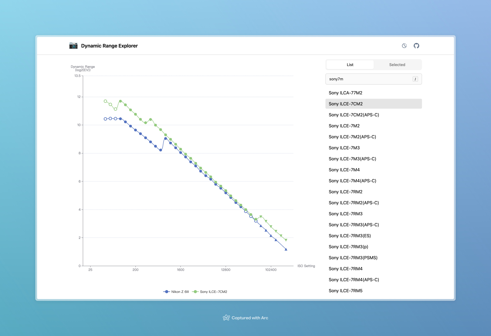

# Dynamic Range Explorer

This project helps users explore the dynamic range of digital cameras through a modern and visually appealing interface.

- Modern UX, including dark mode, responsive design, command palette, etc.
- Scalable codebase built on top of modern JavaScript framework, i.e. [Nuxt.js](https://nuxt.com/)

Data source: https://www.photonstophotos.net/Charts/PDR.htm
