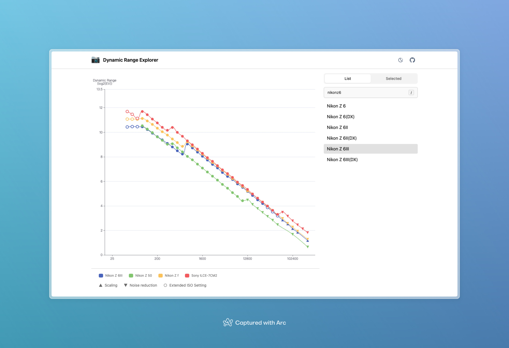

# Dynamic Range Explorer

**[This website](https://dynamicrange.xzd.me/)** provides a better way for photographers to explore the photographic dynamic range of digital cameras, including:

- Modern UX, including dark mode, responsive design, modern user interface, keyboard control, etc.
- Scalable codebase built on top of modern JavaScript framework, i.e. [Nuxt.js](https://nuxt.com/)

Data source: https://www.photonstophotos.net/Charts/PDR.htm
